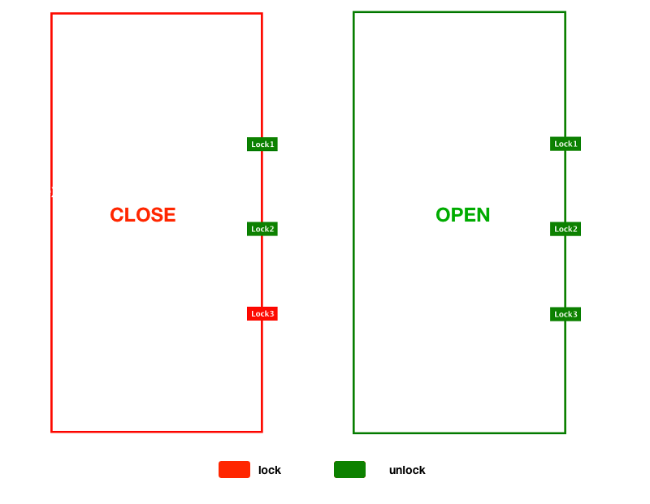

# doors

  door pattern

## Installation

  Install with [component](http://component.io):

    $ component install bredele/doors

  [Stansalone](https://github.com/bredele/doors/blob/master/doors.js):

    $ <script src="doors.js"></script>

## What is the door pattern?



You will find some examples [here](https://github.com/bredele/doors/tree/master/examples). Make sure you build the component first.

    $ make

### The origin

Design patterns are very trendy.
There are two design patterns that are really interesting:

* **State Machine** - Basically, it allows you to change your application from one state to another (this is called a transition) when initiated by a triggering an event or a **condition**. You can define an action to execute asynchronously for each transition. You will find a great State machine [here](https://github.com/flams/emily/blob/master/src/StateMachine.js).

* **Promises** - To use the words of Wikipedia : it represents the value returned from the single completion of an operation. To make it simple, that's a state machine with two immutable transitions : unfulfilled to fulfilled (or unresolve to resolve) and unfulfilled to failed. You will find a great Promises implementation [here](https://github.com/flams/emily/blob/master/src/Promise.js)

Both have something missing. A transition occurs when **one** condition is triggered. Things are not so simple in real life. You will probably have more than one condition to do something, but one condition is sufficient to not do it. Think about a door with multiple locks: **you can't open the door until all locks are unlocked.**

Additionally, things can change and are not necessarily immutable. A door which is unlocked is not open until you actually open it and a door which is opened can be closed and locked again.


## API

  - [Doors()](#doors)
  - [Doors.has()](#doorshaskeystring)
  - [Doors.add()](#doorsaddnamestring)
  - [Doors.lock()](#doorslock)
  - [Doors.unlock()](#doorsunlock)
  - [Doors.toggle()](#doorstogglenamestringboolboolean)
  - [Doors.open()](#doorsopen)
  - [Doors.on()](#doorson)

### Doors(key:String, [locks:Array])

  Doors constructor. Initialize door with a key (mandatory) and
  an optional array of locks.

```js
  var Doors = require('doors');
  var door = new Doors('github');
```

### Doors.has(key:String)

  Return true if has lock.

### Doors.add(key:String)

  Add string lock or child door.

```js
  door.add('olivier');
  door.add(new Doors('child')); 
```

### Doors.lock()

  Lock a previously added lock.

  
```js
  door.lock('olivier'); //lock 'olivier'
  door.lock('olivier', 'amy'); //lock 'olivier' and 'amy'
  door.lock(); //lock all the locks
```

### Doors.unlock()

  Unlock door's lock(s).

  
```js
  door.unlock('olivier'); //unlock 'olivier'
  door.unlock('olivier', 'amy'); //unlock 'olivier' and 'amy'
  door.unlock(); //unlock all the locks
```

### Doors.toggle(key:String, bool:Boolean)

  Toggle Lock.

```js
  door.toggle('olivier'); //lock
  door.toggle('olivier', true); //unlock

```

### Doors.open()

  Open the door only if all locks are unlocked.
  and emit open event.


### Doors.on(topic:String, callback:Function)

  Listen door events.

```js
  door.toggle('open', function(){
    //do something
  }); 
```

## License

  MIT
